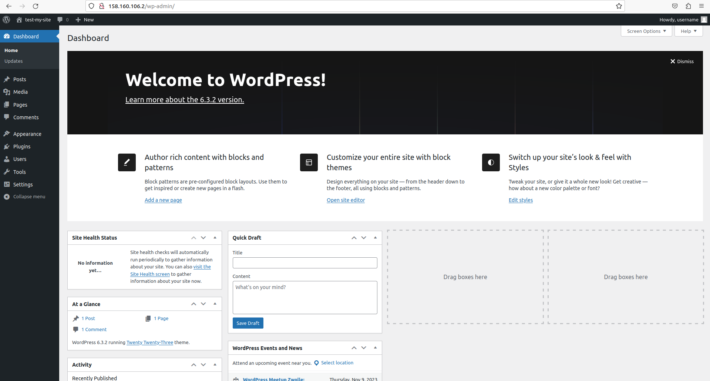

# Ansible-роль для установки WordPress


# Корректировка манифестов терраформ

> Так как у WordPress в стандартной конфигурации нет специального пути вида /health, то для проверки “здоровья” узлов в attached_target_group в файле 
> lb.tf надо заменить блок healthcheck на следующий:

> Файл lb.tf

```
healthcheck {
      name = "tcp"
      tcp_options {
        port = 80
      }
    }
```

> В файл output.tf добавим вывод второго IP и id mysql кластера:

```
output "vm_linux_2_public_ip_address" {
  description = "Virtual machine IP"
  value = yandex_compute_instance.wp-app-2.network_interface[0].nat_ip_address
}

output "mysql_cluster_id" {
  description = "Name of the MySQL cluster"
  value = yandex_mdb_mysql_cluster.wp_mysql.id
}
```

> Добавим в os_images образ ubuntu 20

```
data "yandex_compute_image" "lamp" {
  family = "lamp"
}

data "yandex_compute_image" "lemp" {
  family = "lemp"
}

data "yandex_compute_image" "ubuntu-20" {
  family = "ubuntu-2004-lts"
}
```

> Так как у нас использовались ранее lamp и lemp обаразы для создания виртуальных машин, изменим на использование образа ubuntu-20

> Команда для просмотра доступных образов в yandex cloud yc compute image list --folder-id standard-images

> Файл wb-app.tf

```
resource "yandex_compute_instance" "wp-app-1" {
  name = "wp-app-1"
  zone = "ru-central1-a"

  resources {
    cores  = 2
    memory = 2
  }

  boot_disk {
    initialize_params {
      image_id = data.yandex_compute_image.ubuntu-20.id
    }
  }

  network_interface {
    # Указан id подсети default-ru-central1-a
    subnet_id = yandex_vpc_subnet.wp-subnet-a.id
    nat       = true
  }

  metadata = {
    ssh-keys = "ubuntu:${file("~/.ssh/id_rsa.pub")}"
  }
}

resource "yandex_compute_instance" "wp-app-2" {
  name = "wp-app-2"
  zone = "ru-central1-b"

  resources {
    cores  = 2
    memory = 2
  }

  boot_disk {
    initialize_params {
      image_id = data.yandex_compute_image.ubuntu-20.id
    }
  }

  network_interface {
    # Указан id подсети default-ru-central1-b
    subnet_id = yandex_vpc_subnet.wp-subnet-b.id
    nat       = true
  }

  metadata = {
    ssh-keys = "ubuntu:${file("~/.ssh/id_rsa.pub")}"
  }
}
```

> Применим изменения:

```
terraform apply --auto-approve
```

# Разработка плейбука

> Прежде всего создадим каталог ansible на одном уровне с каталогом terraform:

```
mkdir ansible
cd ansible
mkdir -p environments/prod/group_vars
mkdir files templates playbooks roles logs
```

> Предназначение этих каталогов следующее:

```
в environments будут храниться инвентори и значения групповых переменных для определенной среды развертывания. В нашем случае это будет prod - т.е. продуктовая среда.
в files будут храниться файлы, которые мы будем использовать в неизменном виде
в templates будут храниться шаблоны
в playbooks будут складываться плейбуки Ansible каталог roles предназначен для хранения ролей
```

> Далее мы создадим файл ansible.cfg с описанием настроек Ansible.


```
[defaults]
#Лог запуска playbooks
log_path = ./logs/ansible.log
# Откуда брать инвентори по-умолчанию
inventory = ./environments/prod/inventory
# Под каким пользователем подключаться к хостам
remote_user = ubuntu
# Где брать приватный ключ для подключения к хостам
private_key_file = ~/.ssh/yc
# Выключение проверки SSH Host-keys
host_key_checking = False
# Выключение использования *.retry-файлов
retry_files_enabled = False
# Местонахождение ролей
roles_path = ./roles
```

> Опишем в файле environments/prod/inventory IP хостов, на которые мы будем ставить WordPress.

> inventory 

```
[wp_app]
app ansible_host=130.193.48.144
app2 ansible_host=158.160.65.224
```

> Далее, создадим файл с групповыми переменными для группы хостов wp_app в каталоге environments/prod/group_vars

> Определить FQDN для нашей базы сможем при помощи инструкции от Яндекс.Облака: 
> https://cloud.yandex.com/en-ru/docs/managed-mysql/operations/connect#fqdn-master ID кластера MySQL можно найти веб-консоли Яндекс.Облака:

> Имя базы данных, имя пользователя базы данных и его пароль вы указывали в соответствующем манифесте терраформа.


> wp_app


```
wordpress_db_name: db
wordpress_db_user: user
wordpress_db_password: password
wordpress_db_host: c-c9qnl5eeidv2hdhf7uaf.rw.mdb.yandexcloud.net
```

> В каталоге playbooks создадим файл install.yml. И наш плейбук будет начинаться с установки необходимых зависимостей, которые понадобятся WordPress-у.

> install.yml 

```
- hosts: wp_app
  become: yes

  tasks:
    - name: Update apt-get repo and cache
      apt: update_cache=yes force_apt_get=yes cache_valid_time=3600

    - name: install dependencies
      package:
        name:
          - apache2
          - ghostscript
          - libapache2-mod-php
          - mysql-server
          - php
          - php-bcmath
          - php-curl
          - php-imagick
          - php-intl
          - php-json
          - php-mbstring
          - php-mysql
          - php-xml
          - php-zip
        state: present
```

> Запустим плейбук и убедимся, что подключение к удаленным хостам прошло успешно и установка пакетов прошла без проблем:

```
ansible-playbook playbooks/install.yml
```

> Следующий наш шаг - это создание на хостах каталога, куда будет установлены WordPress и скачивание дистрибутива WordPress с разархивированием в этот
> каталог.

> Добавим следующие шаги в наш плейбук:

```
  - name: Create the installation directory
      file:
        path: /srv/www
        owner: www-data
        state: directory

    - name: Install WordPress
      unarchive:
        src: https://wordpress.org/latest.tar.gz
        dest: /srv/www
        owner: www-data
        remote_src: yes
```

> Можно еще раз запустить плейбук и убедиться, что новые шаги ничего не поломали:

```
ansible-playbook playbooks/install.yml
```

> Наш следующий шаг - установить описание виртуального хоста для сервиса Apache2, чтобы приходящий на 80-ый порт трафик отправлялся на WordPress.

> И хоть, в данный момент у нас не будет необходимости что-то менять в файле-конфигурации, мы все-таки будем обращаться с ним как с шаблоном.

> Если когда-нибудь потом нам понадобиться действительно шаблонизировать этот конфиг, то нужно будет править только этот файл, в доработке плейбука или
> роли не будет необходимости.

> Итак, в каталоге templates создадим файл wordpress.conf.j2 со следующим содержимым:

> wordpress.conf.j2

```
VirtualHost *:80>
    DocumentRoot /srv/www/wordpress
    <Directory /srv/www/wordpress>
        Options FollowSymLinks
        AllowOverride Limit Options FileInfo
        DirectoryIndex index.php
        Require all granted
    </Directory>
    <Directory /srv/www/wordpress/wp-content>
        Options FollowSymLinks
        Require all granted
    </Directory>
</VirtualHost>
```

> Здесь стоит обратить внимание на указанные пути к сайту - /srv/www/wordpress. Как вы помните, каталог /srv/www мы создавали ранее в плейбуке.

> И данный виртуальный хост будет обрабатывать трафик с 80-го порта. А именно на этот порт будет отправлять трафик балансировщик, который мы создавали
> в манифестах террформа.

> <VirtualHost *:80>

> После того, как мы подготовили эту конфигурацию, добавим шаг в плейбук:

```
 - name: Copy file with owner and permissions
   copy:
      src: ../templates/wordpress.conf.j2
      dest: /etc/apache2/sites-available/wordpress.conf
```

> После того как в конфигурации Apache появилась описание нашего сайта, необходимо выполнить ряд дополнительных шагов:

```
включить в Apache модуль rewrite
“активировать” наш сайт
“деактивировать” сайт-заглушку (“It Works”)
```

> Задачу с включением модуля мы можем решить при помощи ansible-модуля apache2_module. Для остальных задач придется задействовать ansible-модуль shell.

> Добавим новые задачи в плейбук:

```
- name: Enable URL rewriting
      apache2_module:
        name: rewrite
        state: present

    - name: Enable the site
      shell: a2ensite wordpress

    - name: Disable the default “It Works” site
      shell: a2dissite 000-default

    - name: Reload service apache2
      service:
        name: apache2
        state: reloaded
```

> Последняя задача, которую надо решить в этом плейбуке, это подключить WordPress к базе данных MySql.

> Для этого нам понадобится установить на хосты корневой сертификат для соединения с базой данных по SSL. И нам нужно будет внести изменения в
> конфигурацию уже самого WordPress.

> Начнем с сертификата. Сохраним его в каталоге files:

```
wget "https://storage.yandexcloud.net/cloud-certs/CA.pem" -O ./files/root.crt
```

> Далее, в каталоге templates создадим файл wp-config.php.j2 со следующим содержимым:

> wp-config.php.j2

```
<?php
/**
 * The base configuration for WordPress
 *
 * The wp-config.php creation script uses this file during the installation.
 * You don't have to use the web site, you can copy this file to "wp-config.php"
 * and fill in the values.
 *
 * This file contains the following configurations:
 *
 * * MySQL settings
 * * Secret keys
 * * Database table prefix
 * * ABSPATH
 *
 * @link https://wordpress.org/support/article/editing-wp-config-php/
 *
 * @package WordPress
 */

// ** MySQL settings - You can get this info from your web host ** //
/** The name of the database for WordPress */
define( 'DB_NAME', '{{ wordpress_db_name }}' );

/** MySQL database username */
define( 'DB_USER', '{{ wordpress_db_user }}' );

/** MySQL database password */
define( 'DB_PASSWORD', '{{ wordpress_db_password }}' );

/** MySQL hostname */
define( 'DB_HOST', '{{ wordpress_db_host }}' );

/** Database charset to use in creating database tables. */
define( 'DB_CHARSET', 'utf8' );

/** The database collate type. Don't change this if in doubt. */
define( 'DB_COLLATE', '' );

/**#@+
 * Authentication unique keys and salts.
 *
 * Change these to different unique phrases! You can generate these using
 * the {@link https://api.wordpress.org/secret-key/1.1/salt/ WordPress.org secret-key service}.
 *
 * You can change these at any point in time to invalidate all existing cookies.
 * This will force all users to have to log in again.
 *
 * @since 2.6.0
 */
define( 'AUTH_KEY',         'put your unique phrase here' );
define( 'SECURE_AUTH_KEY',  'put your unique phrase here' );
define( 'LOGGED_IN_KEY',    'put your unique phrase here' );
define( 'NONCE_KEY',        'put your unique phrase here' );
define( 'AUTH_SALT',        'put your unique phrase here' );
define( 'SECURE_AUTH_SALT', 'put your unique phrase here' );
define( 'LOGGED_IN_SALT',   'put your unique phrase here' );
define( 'NONCE_SALT',       'put your unique phrase here' );

/**#@-*/

/**
 * WordPress database table prefix.
 *
 * You can have multiple installations in one database if you give each
 * a unique prefix. Only numbers, letters, and underscores please!
 */
$table_prefix = 'wp_';

/**
 * For developers: WordPress debugging mode.
 *
 * Change this to true to enable the display of notices during development.
 * It is strongly recommended that plugin and theme developers use WP_DEBUG
 * in their development environments.
 *
 * For information on other constants that can be used for debugging,
 * visit the documentation.
 *
 * @link https://wordpress.org/support/article/debugging-in-wordpress/
 */
define( 'WP_DEBUG', true );
define( 'WP_DEBUG_LOG', true );

/* Add any custom values between this line and the "stop editing" line. */


/* That's all, stop editing! Happy publishing. */

/** Absolute path to the WordPress directory. */
if ( ! defined( 'ABSPATH' ) ) {
        define( 'ABSPATH', __DIR__ . '/' );
}

define('MYSQL_CLIENT_FLAGS', MYSQLI_CLIENT_SSL);

/** Sets up WordPress vars and included files. */
require_once ABSPATH . 'wp-settings.php';
```

> Как видите, это уже честный шаблон, в который будут подставляться значения из переменных:

```
wordpress_db_name
wordpress_db_user
wordpress_db_password
wordpress_db_host
```
> Как вы помните, это групповые переменные из файла environments/prod/group_vars/wp_app

> Кроме этого стоит обратить внимание на следующую строку:

```
define('MYSQL_CLIENT_FLAGS', MYSQLI_CLIENT_SSL);
```

> Этой переменной мы сообщаем WordPress, что подключение к базе данных будет идти по SSL.

> Добавим финальные шаги в наш плейбук:

```
  - name: Install mysql cert
      copy:
        src: ../files/root.crt
        dest: /usr/local/share/ca-certificates/root.crt

    - name: Update cert index
      shell: /usr/sbin/update-ca-certificates

    - name: Configure WordPress
      template:
        src: ../templates/wp-config.php.j2
        dest: "/srv/www/wordpress/wp-config.php"
        owner: "www-data"
```

> Здесь мы при помощи модуля copy переносим на хосты корневой сертификат.

> Далее при помощи модуля shell обновляем на хостах хранилище сертификатов.

> И, при помощи модуля template, с которым мы уже знакомы (вспоминаем wordpress.conf.j2) загружаем конфигурацию с подключением к базе данных.

> Итого, сейчас наш плейбук должен выглядеть так:

```
- hosts: wp_app
  become: yes

  tasks:
    - name: Update apt-get repo and cache
      apt: update_cache=yes force_apt_get=yes cache_valid_time=3600

    - name: install dependencies
      package:
        name:
          - apache2
          - ghostscript
          - libapache2-mod-php
          - mysql-server
          - php
          - php-bcmath
          - php-curl
          - php-imagick
          - php-intl
          - php-json
          - php-mbstring
          - php-mysql
          - php-xml
          - php-zip
        state: present

    - name: Create the installation directory
      file:
        path: /srv/www
        owner: www-data
        state: directory

    - name: Install WordPress
      unarchive:
        src: https://wordpress.org/latest.tar.gz
        dest: /srv/www
        owner: www-data
        remote_src: yes

    - name: Copy file with owner and permissions
      copy:
        src: ../templates/wordpress.conf.j2
        dest: /etc/apache2/sites-available/wordpress.conf
        owner: "www-data"

    - name: Enable URL rewriting
      apache2_module:
        name: rewrite
        state: present

    - name: Enable the site
      shell: a2ensite wordpress

    - name: Disable the default “It Works” site
      shell: a2dissite 000-default

    - name: Reload service apache2
      service:
        name: apache2
        state: reloaded

    - name: Install mysql cert
      copy:
        src: ../files/root.crt
        dest: /usr/local/share/ca-certificates/root.crt

    - name: Update cert index
      shell: /usr/sbin/update-ca-certificates

    - name: Configure WordPress
      template:
        src: ../templates/wp-config.php.j2
        dest: "/srv/www/wordpress/wp-config.php"
        owner: "www-data"
```

> Страница: 


> Преобразование плейбука в роль. Подготовим структуру каталогов:

```
mkdir roles/wordpress&&cd roles/wordpress&&mkdir default files meta tasks templates
ls
...

Переменные, которые нам необходимы, опишем в файле defaults/main.yml и укажем некие абстрактные значения.

Реальные же значения переменных задаются в описании групповых переменных.

```

> wordpress_db_name: "mysql_db_name" wordpress_db_user: "mysql_username" wordpress_db_password: "mysql_user_password" wordpress_db_host: "mysql_fqdn"

```
В файле meta/main.yml укажем общие сведения о нашей роли
```

```
galaxy_info: role_name: wordpress author: sablin description: Wordpress CMS System license: "license (MIT)"

min_ansible_version: 2.9

galaxy_tags: - linux - server - web - wordpress - cms

platforms: - name: Ubuntu versions: - focal
```

```
Далее, в каталог роли files скопируем корневой сертификат.

А в каталог роли templates скопируем шаблоны wordpress.conf.j2 и wp-config.php.j2.

```bash
cp files/root.crt roles/wordpress/files
cp templates/* roles/wordpress/templates
```

> И нам осталось перенести шаги плейбука в файл tasks/main.yml.


> Структура каталогов роли:

```
.
└── wordpress
    ├── default
    │   └── main.yml
    ├── files
    │   └── root.crt
    ├── meta
    │   └── main.yml
    ├── tasks
    │   └── main.yml
    └── templates
        ├── wordpress.conf.j2
        └── wp-config.php.j2
```

> Основной playbook:

> install.yml 

```
- hosts: all
  become: yes

  roles:
    - role: wordpress
```

> Запустим еще раз плейбук, чтобы убедиться, что ничего не сломалось:

```
ansible-playbook playbooks/install.yml
```



> И теперь самое время удалить в каталоге ansible лишние каталоги - files и templates, так как все необходимое уже переехало в роль wordpress.


> Итоговая структура каталога ansible должна выглядеть так:

```
.
├── ansible.cfg
├── environments
│   └── prod
│       ├── group_vars
│       │   └── wp_app
│       └── inventory
├── playbooks
│   └── install.yml
└── roles
    └── wordpress
        ├── default
        │   └── main.yml
        ├── files
        │   └── root.crt
        ├── meta
        │   └── main.yml
        ├── tasks
        │   └── main.yml
        └── templates
            ├── wordpress.conf.j2
            └── wp-config.php.j2
```

> Ссылка на wordpress сайт ( ip балансировщика ): http://158.160.65.128


